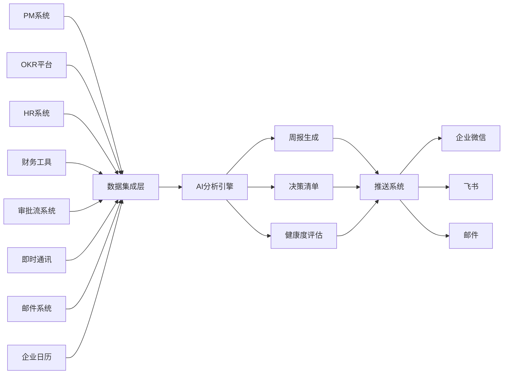

# 智能周报提醒工具 - 产品需求文档

## 1. 项目概述

### 1.1 项目名称
智能周报提醒工具（AI Weekly Report Reminder）

### 1.2 产品定位
面向中高层管理者（总监/VP）的智能周报提醒系统，旨在帮助管理者在每周固定时间内（10分钟以内）高效获取关键信息并明确决策事项。

### 1.3 核心价值
- **信息整合**：自动整合多系统数据，消除信息孤岛
- **智能分析**：AI驱动的关键信息提炼与决策建议
- **高效决策**：快速掌握业务状态与关键风险
- **前瞻预警**：提前预知下周需要关注的重要事项

### 1.4 成功标准
- 管理者每周使用时间 ≤ 10分钟
- 关键信息覆盖率 ≥ 95%
- 决策事项处理效率提升 ≥ 50%

---

## 2. 核心目标

### 2.1 用户目标
1. 快速掌握本周整体业务状态与关键风险
2. 明确本周需要处理的决策事项与优先级
3. 了解业务目标与团队健康度的核心信号
4. 提前预知下周需要关注的重要事项

### 2.2 业务目标
1. 降低管理者信息整合的认知成本
2. 提高决策效率与质量
3. 增强团队协作与执行力
4. 提升组织决策透明度

---

## 3. 功能需求

### 3.1 模块一：本周总览（AI生成）

| 需求点 | 描述 | 优先级 |
| :--- | :--- | :--- |
| AI总结生成 | 整合所有模块数据，自动生成3-5句简洁的整体判断 | 高 |
| 核心内容 | 本周整体状态、最需关注的1-2件事、下周最大风险 | 高 |
| 一键复制 | 提供复制功能，可直接作为向上级汇报的周报草稿 | 中 |
| 位置优先级 | 页面顶部，作为第一眼看到的内容 | 高 |

### 3.2 模块二：我的决策清单（核心行动模块）

| 需求点 | 描述 | 优先级 |
| :--- | :--- | :--- |
| 三级分类 | 需要动作、需要决策、知会即可 | 高 |
| 项目决策 | 卡住等待拍板的项目决策，附路径文档、邮件链接 | 高 |
| 资源审批 | 待审批的资源/预算申请，链接至内部审批系统 | 高 |
| 跨团队协调 | 需要介入的跨团队协调问题（来源于微信群、飞书群等） | 高 |
| Escalation处理 | 下属发起的Escalation未处理项 | 高 |
| 一键跳转 | 每条事项可直接点击跳转处理 | 高 |
| 智能排序 | 按紧急程度自动排序 | 高 |
| AI提炼 | 群内重要管理者观点按群组级别提取 | 中 |
| 文档邮件总结 | 对有权限访问的文档、邮件进行AI总结 | 中 |

### 3.3 模块三：业务与目标健康度

#### 3.3.1 项目节点部分

| 需求点 | 描述 | 优先级 |
| :--- | :--- | :--- |
| 里程碑状态 | 各团队重要里程碑完成情况（绿/黄/红三色标识） | 高 |
| 延期标注 | 本周延期项目及原因标注 | 高 |
| 依赖阻塞 | 跨团队依赖项的阻塞情况 | 高 |
| 异常置顶 | 异常项目自动置顶 | 高 |
| 绿灯精简 | 绿灯项目精简展示 | 中 |

#### 3.3.2 OKR进展部分

| 需求点 | 描述 | 优先级 |
| :--- | :--- | :--- |
| OKR健康度 | 本季度OKR整体健康度（总监：团队级；VP：BU级） | 高 |
| KPI节点 | 本周临近或到期的关键KPI节点 | 高 |
| 趋势判断 | 落后指标的趋势方向（变好/恶化） | 高 |
| 目标达成判断 | 呈现"按当前速度能否达成目标"的判断 | 高 |

### 3.4 模块四：团队动态

| 需求点 | 描述 | 优先级 |
| :--- | :--- | :--- |
| 1on1覆盖 | 标识超过2周未进行1on1的下属 | 高 |
| 人事动态 | 本周入职、离职、转岗情况 | 中 |
| 招聘进展 | 在招岗位的漏斗状态 | 中 |
| 重要日期 | 团队成员生日、工作周年纪念日 | 低 |
| 关键岗位关注 | 重点关注关键岗位、-1层级人员 | 高 |

### 3.5 模块五：下周预警

| 需求点 | 描述 | 优先级 |
| :--- | :--- | :--- |
| 高风险节点 | 下周高风险交付节点 | 高 |
| 重要会议提示 | 重要会议/述职/汇报提前提示 | 高 |
| OKR倒计时 | OKR关键时间线倒计时 | 中 |
| 资源冲突预警 | 跨团队资源冲突预警 | 中 |

---

## 4. 数据集成需求

### 4.1 数据源系统

| 系统类型 | 描述 | 优先级 |
| :--- | :--- | :--- |
| PM系统 | 项目管理系统数据接入 | 高 |
| OKR平台 | OKR目标管理数据接入 | 高 |
| HR系统 | 人事数据、招聘数据接入 | 中 |
| 财务工具 | 预算、资源申请数据接入 | 高 |
| 审批流系统 | 审批状态数据接入 | 高 |
| 企业即时通讯 | 微信/飞书群消息接入 | 中 |
| 邮件系统 | 邮件数据接入 | 中 |
| 企业日历 | 会议日程数据接入 | 中 |

### 4.2 数据同步机制

| 需求点 | 描述 | 优先级 |
| :--- | :--- | :--- |
| 实时同步 | 关键数据实时同步（审批、Escalation等） | 高 |
| 定时同步 | 非实时数据定时同步（OKR、团队动态等） | 中 |
| 增量同步 | 支持增量数据同步，减少数据传输量 | 中 |
| 数据准确性 | 确保数据一致性与准确性 | 高 |

### 4.3 数据权限控制

| 需求点 | 描述 | 优先级 |
| :--- | :--- | :--- |
| 层级适配 | 不同级别管理者看到对应权限的数据 | 高 |
| 数据隔离 | 确保数据安全与信息保密 | 高 |
| 角色权限 | 基于角色的访问控制（RBAC） | 高 |

---

## 5. AI分析引擎需求

### 5.1 自然语言处理

| 需求点 | 描述 | 优先级 |
| :--- | :--- | :--- |
| 周报总结 | 自动生成本周总览的AI总结 | 高 |
| 文档摘要 | 对文档、邮件进行AI总结 | 中 |
| 观点提取 | 从群消息中提取重要管理者观点 | 中 |

### 5.2 智能分类与优先级

| 需求点 | 描述 | 优先级 |
| :--- | :--- | :--- |
| 决策事项分类 | 自动分类为需要动作、需要决策、知会即可 | 高 |
| 优先级排序 | 根据紧急程度、重要性自动排序 | 高 |
| 智能分级 | 对决策事项进行分级处理 | 高 |

### 5.3 业务健康度评估

| 需求点 | 描述 | 优先级 |
| :--- | :--- | :--- |
| 红绿灯评估 | 将原始数据转化为红绿灯状态信号 | 高 |
| 趋势分析 | 分析指标趋势方向（变好/恶化） | 高 |
| 达成预测 | 判断按当前速度能否达成目标 | 高 |

### 5.4 异常检测

| 需求点 | 描述 | 优先级 |
| :--- | :--- | :--- |
| 异常识别 | 自动识别需要关注的异常情况与风险点 | 高 |
| 风险预警 | 提前预警潜在风险 | 高 |
| 异常置顶 | 异常项目自动置顶显示 | 高 |

---

## 6. 推送系统需求

### 6.1 多渠道推送

| 渠道 | 描述 | 优先级 |
| :--- | :--- | :--- |
| 企业微信 | 支持企业微信推送 | 高 |
| 飞书 | 支持飞书推送 | 高 |
| 邮件 | 支持邮件推送 | 中 |

### 6.2 定时推送

| 需求点 | 描述 | 优先级 |
| :--- | :--- | :--- |
| 默认时间 | 每周一早上8:30推送 | 高 |
| 自定义时间 | 支持用户自定义推送时间 | 中 |
| 格式适配 | 确保推送内容的格式适配各平台要求 | 高 |

---

## 7. 界面与交互设计规范

### 7.1 整体设计原则

| 原则 | 描述 |
| :--- | :--- |
| 阅读心流优先 | 信息按逻辑顺序组织：整体状态→需要行动事项→背景细节→未来预警 |
| 简洁清晰 | 突出关键信息与行动项 |
| 响应式设计 | 支持在不同设备上查看 |
| 快速加载 | 界面加载速度快，信息呈现直观易懂 |

### 7.2 层级适配

#### 7.2.1 总监级别视图

| 特性 | 描述 |
| :--- | :--- |
| 数据范围 | 展示跨团队的汇总信号 |
| OKR粒度 | 显示团队级数据 |
| 关注重点 | 团队协作与执行层面问题 |

#### 7.2.2 VP级别视图

| 特性 | 描述 |
| :--- | :--- |
| 数据范围 | 展示跨业务线的趋势与战略风险 |
| OKR粒度 | 显示BU级数据 |
| 关注重点 | 业务方向与战略执行情况 |

---

## 8. 非功能需求

### 8.1 性能需求

| 指标 | 要求 |
| :--- | :--- |
| 页面加载时间 | ≤ 2秒 |
| 数据更新延迟 | ≤ 5分钟（关键数据） |
| 系统可用性 | ≥ 99.9% |

### 8.2 安全需求

| 需求 | 描述 |
| :--- | :--- |
| 数据加密 | 传输与存储均需加密 |
| 访问控制 | 严格的权限管理 |
| 审计日志 | 记录关键操作日志 |

### 8.3 兼容性需求

| 平台 | 要求 |
| :--- | :--- |
| 浏览器 | Chrome、Safari、Edge最新版本 |
| 移动端 | 支持iOS、Android移动端浏览器 |
| 企业应用 | 企业微信、飞书内嵌应用支持 |

---

## 9. 实施计划

### 9.1 开发阶段

| 阶段 | 时间 | 内容 |
| :--- | :--- | :--- |
| Phase 1 | 第1-2周 | 核心模块开发（决策清单、业务健康度） |
| Phase 2 | 第3-4周 | 数据集成（PM、OKR、审批系统） |
| Phase 3 | 第5-6周 | AI模型训练与优化 |
| Phase 4 | 第7-8周 | 推送系统与团队动态模块 |
| Phase 5 | 第9-10周 | 下周预警模块与整体集成 |

### 9.2 测试阶段

| 测试类型 | 内容 |
| :--- | :--- |
| 用户测试 | 多轮管理者反馈收集与迭代优化 |
| 视图测试 | 不同层级用户视图的准确性与适用性 |
| 数据测试 | 数据同步的实时性与推送的可靠性 |
| 安全测试 | 信息安全与权限控制测试 |

### 9.3 上线与迭代

| 阶段 | 内容 |
| :--- | :--- |
| 灰度发布 | 采用灰度发布策略，逐步扩大使用范围 |
| 反馈机制 | 建立用户反馈收集机制 |
| 持续迭代 | 根据反馈持续优化功能与体验 |

---

## 10. 附录

### 10.1 术语定义

| 术语 | 定义 |
| :--- | :--- |
| Escalation | 下属向上级发起的需要紧急处理的事项 |
| OKR | 目标与关键结果（Objectives and Key Results） |
| BU | 业务单元（Business Unit） |
| 红绿灯状态 | 绿（正常）、黄（警告）、红（异常）三种状态标识 |

### 10.2 数据流向图

---

**文档版本**: v1.0  
**创建日期**: 2026年5月  
**作者**: 产品团队