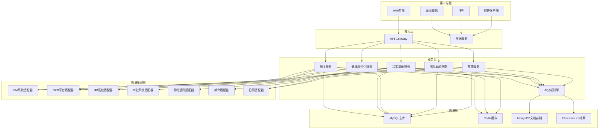
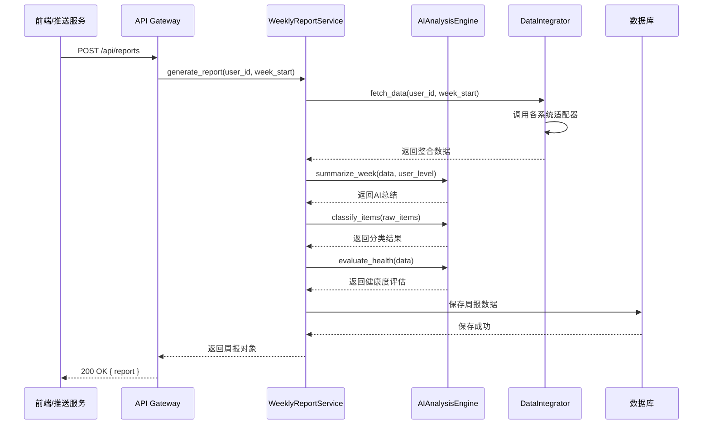
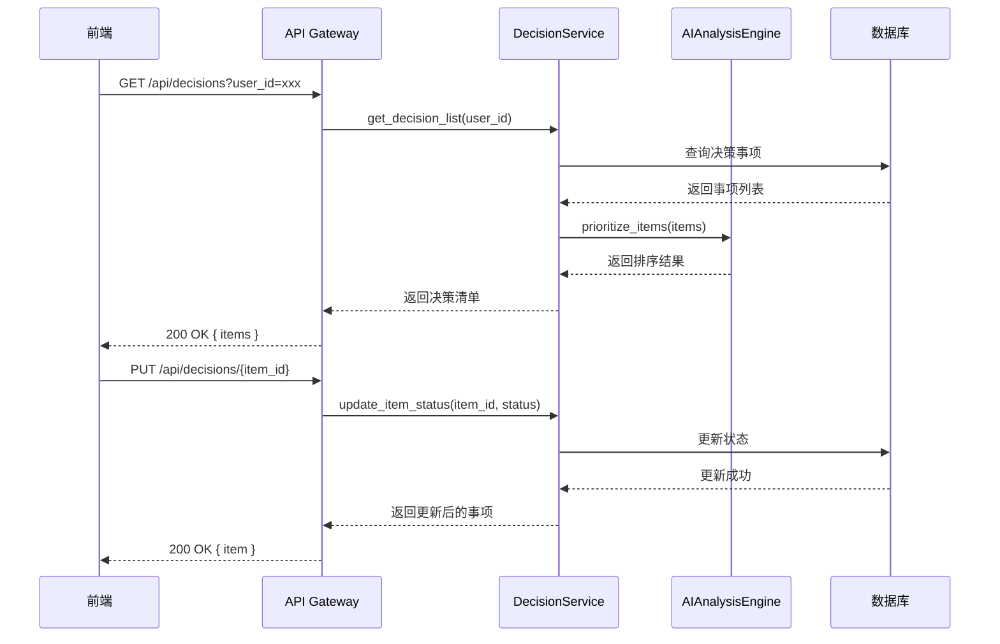
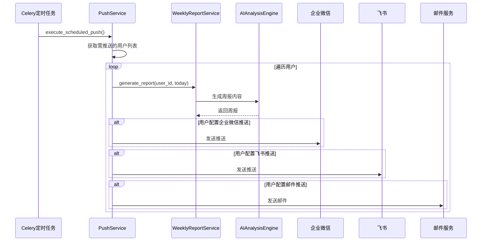
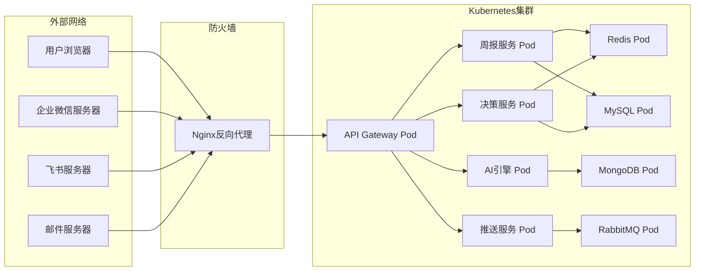
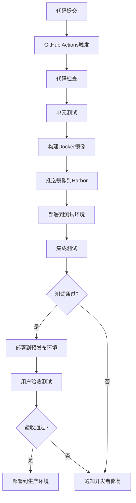
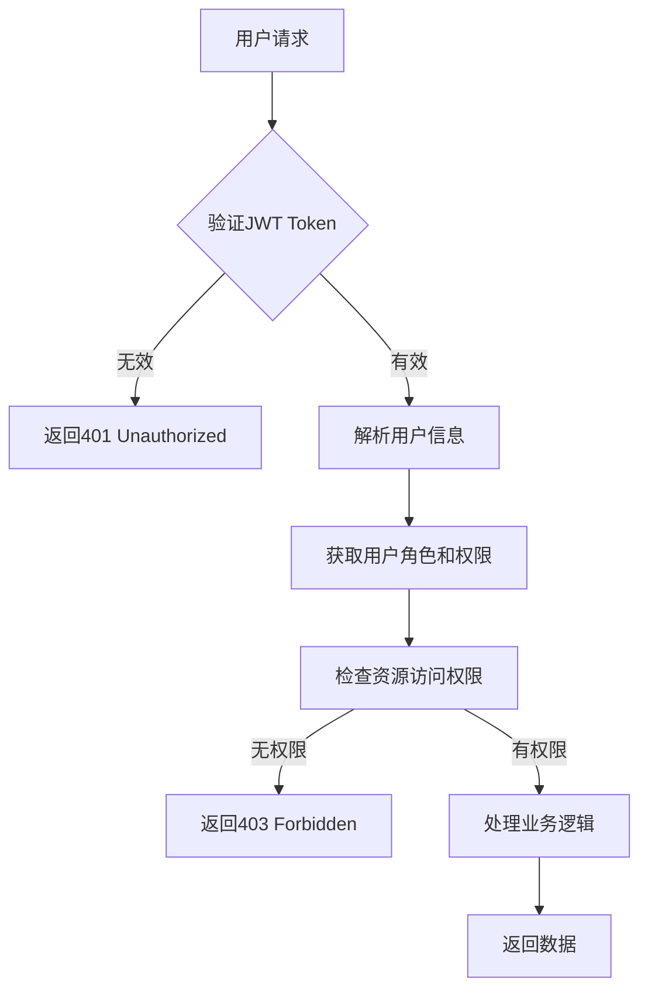

# 智能周报提醒工具 - 技术架构文档

## 1. 架构概述

### 1.1 架构风格
采用 **微服务架构** 与 **事件驱动架构** 相结合的方式，确保系统的可扩展性、可维护性和高可用性。

### 1.2 核心设计原则
- **高内聚低耦合**：各模块职责清晰，接口定义明确
- **松耦合集成**：通过API Gateway实现统一接入
- **弹性设计**：支持水平扩展，应对高并发场景
- **安全性优先**：数据加密、权限控制贯穿始终

### 1.3 系统架构图



---

## 2. 技术选型

### 2.1 前端技术栈

| 分类 | 技术 | 版本 | 选型理由 |
| :--- | :--- | :--- | :--- |
| 框架 | React | 18+ | 成熟稳定，生态完善，适合企业级应用 |
| 语言 | TypeScript | 5+ | 类型安全，提高代码质量和可维护性 |
| UI组件 | Ant Design | 5+ | 企业级设计语言，组件丰富，开箱即用 |
| 状态管理 | Redux Toolkit | 2+ | 统一状态管理，支持异步数据流 |
| 图表库 | ECharts | 5+ | 强大的数据可视化能力，支持多种图表类型 |
| 构建工具 | Vite | 6+ | 快速构建，热更新支持好 |
| 路由 | React Router | 6+ | 声明式路由，支持嵌套路由 |

### 2.2 后端技术栈

| 分类 | 技术 | 版本 | 选型理由 |
| :--- | :--- | :--- | :--- |
| 语言 | Python | 3.12+ | 生态成熟，AI/ML支持好，数据处理能力强 |
| 框架 | FastAPI | 0.110+ | 高性能，自动API文档，现代Python特性支持 |
| 数据库 | MySQL | 8+ | 关系型数据库，事务支持好，适合结构化数据 |
| 缓存 | Redis | 7+ | 高性能缓存，支持多种数据结构 |
| 文档存储 | MongoDB | 7+ | 非结构化数据存储，适合AI分析结果 |
| 搜索 | Elasticsearch | 8+ | 全文搜索，支持复杂查询 |
| 消息队列 | RabbitMQ | 3+ | 异步消息处理，解耦系统 |
| 定时任务 | Celery | 5+ | 分布式任务调度，支持定时任务 |

### 2.3 AI技术栈

| 分类 | 技术 | 版本 | 选型理由 |
| :--- | :--- | :--- | :--- |
| 大语言模型 | OpenAI API / 国产大模型 | - | 提供强大的自然语言处理能力 |
| 向量数据库 | Pinecone | - | 支持向量存储和相似度搜索 |
| 文本处理 | spaCy | 3+ | 强大的NLP处理能力 |
| 数据分析 | Pandas | 2+ | 数据处理和分析 |
| 机器学习 | scikit-learn | 1+ | 经典ML算法支持 |

### 2.4 部署与运维

| 分类 | 技术 | 版本 | 选型理由 |
| :--- | :--- | :--- | :--- |
| 容器化 | Docker | 25+ | 应用容器化，环境一致性 |
| 编排 | Kubernetes | 1.29+ | 容器编排，自动扩缩容 |
| CI/CD | GitHub Actions | - | 持续集成和部署 |
| 监控 | Prometheus + Grafana | - | 系统监控和可视化 |
| 日志 | ELK Stack | - | 日志收集和分析 |

---

## 3. 模块划分与职责

### 3.1 模块架构图

```mermaid
graph TD
    A[智能周报系统] --> B[前端展示层]
    A --> C[API网关层]
    A --> D[业务服务层]
    A --> E[数据集成层]
    A --> F[AI分析层]
    A --> G[数据存储层]
    A --> H[推送服务层]
    
    B --> B1[周报总览模块]
    B --> B2[决策清单模块]
    B --> B3[健康度模块]
    B --> B4[团队动态模块]
    B --> B5[预警模块]
    
    D --> D1[周报服务]
    D --> D2[决策服务]
    D --> D3[健康度服务]
    D --> D4[团队服务]
    D --> D5[预警服务]
    D --> D6[用户权限服务]
    
    E --> E1[PM适配器]
    E --> E2[OKR适配器]
    E --> E3[HR适配器]
    E --> E4[审批适配器]
    E --> E5[IM适配器]
    
    F --> F1[NLP处理引擎]
    F --> F2[优先级算法引擎]
    F --> F3[健康度评估引擎]
    F --> F4[异常检测引擎]
    
    G --> G1[关系型数据库]
    G --> G2[缓存层]
    G --> G3[文档存储]
    
    H --> H1[企业微信推送]
    H --> H2[飞书推送]
    H --> H3[邮件推送]
```



### 3.2 核心模块职责

| 模块 | 职责描述 |
| :--- | :--- |
| **周报服务** | 周报生成、AI总结、历史周报管理 |
| **决策服务** | 决策事项分类、优先级排序、状态管理 |
| **健康度服务** | 项目状态评估、OKR进度计算、趋势分析 |
| **团队服务** | 人事动态管理、1on1跟踪、招聘进展 |
| **预警服务** | 风险识别、时间线预警、资源冲突检测 |
| **用户权限服务** | 用户认证、角色管理、数据权限控制 |
| **NLP引擎** | 文本摘要、观点提取、情感分析 |
| **推送服务** | 多渠道消息推送、定时任务调度 |

---

## 4. 关键类与方法设计

### 4.1 核心服务类

#### 4.1.1 WeeklyReportService

| 方法名 | 功能说明 | 参数 | 返回值 |
| :--- | :--- | :--- | :--- |
| `generate_report` | 生成周报 | `user_id: str`, `week_start: date` | `WeeklyReport` |
| `get_report` | 获取周报详情 | `report_id: str` | `WeeklyReport` |
| `list_reports` | 获取周报列表 | `user_id: str`, `page: int`, `size: int` | `List[WeeklyReport]` |
| `update_report` | 更新周报 | `report_id: str`, `data: dict` | `WeeklyReport` |

#### 4.1.2 DecisionService

| 方法名 | 功能说明 | 参数 | 返回值 |
| :--- | :--- | :--- | :--- |
| `classify_items` | 分类决策事项 | `items: List[RawItem]` | `List[ClassifiedItem]` |
| `prioritize_items` | 优先级排序 | `items: List[ClassifiedItem]` | `List[PrioritizedItem]` |
| `get_decision_list` | 获取决策清单 | `user_id: str`, `status: str` | `List[DecisionItem]` |
| `update_item_status` | 更新事项状态 | `item_id: str`, `status: str` | `DecisionItem` |

#### 4.1.3 HealthService

| 方法名 | 功能说明 | 参数 | 返回值 |
| :--- | :--- | :--- | :--- |
| `evaluate_project_health` | 评估项目健康度 | `project_ids: List[str]` | `List[ProjectHealth]` |
| `evaluate_okr_health` | 评估OKR健康度 | `user_id: str`, `level: str` | `OKRHealth` |
| `calculate_trend` | 计算趋势 | `metric_id: str`, `period: str` | `TrendResult` |

#### 4.1.4 AI分析引擎类

| 方法名 | 功能说明 | 参数 | 返回值 |
| :--- | :--- | :--- | :--- |
| `summarize_week` | 生成周报总结 | `data: dict`, `user_level: str` | `str` |
| `extract_key_points` | 提取关键点 | `text: str`, `max_points: int` | `List[str]` |
| `detect_anomalies` | 异常检测 | `data: dict` | `List[Anomaly]` |
| `classify_text` | 文本分类 | `text: str`, `categories: List[str]` | `str` |

---

## 5. 数据库与数据结构设计

### 5.1 数据库表设计

#### 5.1.1 用户表 (users)

| 字段名 | 类型 | 约束 | 说明 |
| :--- | :--- | :--- | :--- |
| `id` | VARCHAR(36) | PRIMARY KEY | 用户唯一标识 |
| `name` | VARCHAR(100) | NOT NULL | 用户姓名 |
| `email` | VARCHAR(255) | UNIQUE | 邮箱 |
| `level` | VARCHAR(20) | NOT NULL | 级别(DIR/VP) |
| `department` | VARCHAR(100) | | 部门 |
| `role` | VARCHAR(50) | NOT NULL | 角色 |
| `created_at` | DATETIME | DEFAULT CURRENT_TIMESTAMP | 创建时间 |
| `updated_at` | DATETIME | ON UPDATE CURRENT_TIMESTAMP | 更新时间 |

#### 5.1.2 周报表 (weekly_reports)

| 字段名 | 类型 | 约束 | 说明 |
| :--- | :--- | :--- | :--- |
| `id` | VARCHAR(36) | PRIMARY KEY | 周报ID |
| `user_id` | VARCHAR(36) | FOREIGN KEY | 用户ID |
| `week_start` | DATE | NOT NULL | 周开始日期 |
| `week_end` | DATE | NOT NULL | 周结束日期 |
| `summary` | TEXT | | AI生成的总结 |
| `status` | VARCHAR(20) | DEFAULT 'generated' | 状态 |
| `created_at` | DATETIME | DEFAULT CURRENT_TIMESTAMP | 创建时间 |

#### 5.1.3 决策事项表 (decision_items)

| 字段名 | 类型 | 约束 | 说明 |
| :--- | :--- | :--- | :--- |
| `id` | VARCHAR(36) | PRIMARY KEY | 事项ID |
| `report_id` | VARCHAR(36) | FOREIGN KEY | 周报ID |
| `title` | VARCHAR(255) | NOT NULL | 标题 |
| `description` | TEXT | | 描述 |
| `category` | VARCHAR(20) | NOT NULL | 分类(action/decision/inform) |
| `priority` | INT | DEFAULT 3 | 优先级(1-5) |
| `status` | VARCHAR(20) | DEFAULT 'pending' | 状态 |
| `source_url` | VARCHAR(500) | | 来源链接 |
| `due_date` | DATE | | 截止日期 |
| `created_at` | DATETIME | DEFAULT CURRENT_TIMESTAMP | 创建时间 |

#### 5.1.4 OKR健康度表 (okr_health)

| 字段名 | 类型 | 约束 | 说明 |
| :--- | :--- | :--- | :--- |
| `id` | VARCHAR(36) | PRIMARY KEY | 记录ID |
| `user_id` | VARCHAR(36) | FOREIGN KEY | 用户ID |
| `okr_id` | VARCHAR(36) | NOT NULL | OKR ID |
| `okr_name` | VARCHAR(255) | NOT NULL | OKR名称 |
| `progress` | DECIMAL(5,2) | NOT NULL | 进度(0-100) |
| `status` | VARCHAR(10) | NOT NULL | 状态(green/yellow/red) |
| `trend` | VARCHAR(10) | | 趋势(up/down/stable) |
| `period` | VARCHAR(20) | NOT NULL | 周期(quarter/month) |
| `updated_at` | DATETIME | DEFAULT CURRENT_TIMESTAMP | 更新时间 |

### 5.2 核心数据结构

#### 5.2.1 WeeklyReport

```python
class WeeklyReport(BaseModel):
    id: str
    user_id: str
    week_start: date
    week_end: date
    summary: str
    decision_items: List[DecisionItem]
    health_overview: HealthOverview
    team_dynamics: TeamDynamics
    next_week_alerts: List[Alert]
    status: str
    created_at: datetime
```

#### 5.2.2 DecisionItem

```python
class DecisionItem(BaseModel):
    id: str
    title: str
    description: str
    category: Literal["action", "decision", "inform"]
    priority: int
    status: str
    source_url: Optional[str]
    due_date: Optional[date]
    ai_summary: Optional[str]
```

#### 5.2.3 HealthOverview

```python
class HealthOverview(BaseModel):
    project_health: List[ProjectHealth]
    okr_health: OKRHealthSummary
    overall_status: Literal["green", "yellow", "red"]
```

#### 5.2.4 Alert

```python
class Alert(BaseModel):
    id: str
    type: str
    title: str
    description: str
    severity: Literal["high", "medium", "low"]
    due_date: date
    related_items: List[str]
```

---

## 6. API接口设计

### 6.1 周报相关接口

| API路径 | HTTP方法 | 所属服务 | 功能描述 |
| :--- | :--- | :--- | :--- |
| `/api/reports` | POST | WeeklyReportService | 生成周报 |
| `/api/reports/{report_id}` | GET | WeeklyReportService | 获取周报详情 |
| `/api/reports` | GET | WeeklyReportService | 获取周报列表 |
| `/api/reports/{report_id}` | PUT | WeeklyReportService | 更新周报 |
| `/api/reports/{report_id}` | DELETE | WeeklyReportService | 删除周报 |

#### POST /api/reports 请求体

```json
{
  "user_id": "string",
  "week_start": "2026-05-19",
  "force_regenerate": false
}
```

#### GET /api/reports/{report_id} 响应体

```json
{
  "id": "string",
  "user_id": "string",
  "week_start": "2026-05-19",
  "week_end": "2026-05-25",
  "summary": "string",
  "decision_items": [],
  "health_overview": {},
  "team_dynamics": {},
  "next_week_alerts": [],
  "status": "generated",
  "created_at": "2026-05-26T08:30:00Z"
}
```

### 6.2 决策清单接口

| API路径 | HTTP方法 | 所属服务 | 功能描述 |
| :--- | :--- | :--- | :--- |
| `/api/decisions` | GET | DecisionService | 获取决策清单 |
| `/api/decisions/{item_id}` | GET | DecisionService | 获取事项详情 |
| `/api/decisions/{item_id}` | PUT | DecisionService | 更新事项状态 |

#### GET /api/decisions 请求参数

| 参数名 | 类型 | 必填 | 说明 |
| :--- | :--- | :--- | :--- |
| `user_id` | string | 是 | 用户ID |
| `category` | string | 否 | 分类过滤 |
| `status` | string | 否 | 状态过滤 |

### 6.3 健康度接口

| API路径 | HTTP方法 | 所属服务 | 功能描述 |
| :--- | :--- | :--- | :--- |
| `/api/health/projects` | GET | HealthService | 获取项目健康度 |
| `/api/health/okr` | GET | HealthService | 获取OKR健康度 |
| `/api/health/trend` | GET | HealthService | 获取趋势分析 |

### 6.4 用户权限接口

| API路径 | HTTP方法 | 所属服务 | 功能描述 |
| :--- | :--- | :--- | :--- |
| `/api/users/me` | GET | UserService | 获取当前用户信息 |
| `/api/users/{user_id}` | GET | UserService | 获取用户详情 |
| `/api/permissions` | GET | PermissionService | 获取用户权限 |

---

## 7. 主业务流程与调用链

### 7.1 周报生成流程



### 7.2 决策事项处理流程



### 7.3 定时推送流程



---

## 8. 部署与集成方案

### 8.1 部署架构



### 8.2 环境配置

| 环境 | 描述 | 配置说明 |
| :--- | :--- | :--- |
| 开发环境 | 本地开发测试 | 使用Docker Compose启动 |
| 测试环境 | 集成测试 | 独立K8s命名空间 |
| 预发布环境 | 灰度发布验证 | 与生产环境配置一致 |
| 生产环境 | 正式运行 | 多副本高可用配置 |

### 8.3 CI/CD流程



---

## 9. 代码安全性

### 9.1 安全原则

| 原则 | 说明 |
| :--- | :--- |
| **最小权限原则** | 用户只能访问其权限范围内的数据 |
| **数据加密** | 传输使用HTTPS，敏感数据加密存储 |
| **输入验证** | 所有输入进行严格验证，防止注入攻击 |
| **审计日志** | 记录关键操作，便于追踪 |
| **安全更新** | 定期更新依赖，修复安全漏洞 |

### 9.2 安全措施

| 措施 | 描述 | 实施位置 |
| :--- | :--- | :--- |
| JWT认证 | 使用JWT token进行用户认证 | API Gateway |
| RBAC权限控制 | 基于角色的访问控制 | 用户权限服务 |
| 输入验证 | Pydantic模型验证 | 所有API端点 |
| SQL注入防护 | 使用ORM参数化查询 | 所有数据库操作 |
| XSS防护 | 前端数据转义 | React前端 |
| CSRF防护 | 前端Token验证 | API Gateway |
| 敏感数据脱敏 | 日志和响应中脱敏处理 | 全局中间件 |

### 9.3 数据权限控制



---

**文档版本**: v1.0  
**创建日期**: 2026年5月  
**作者**: 技术团队